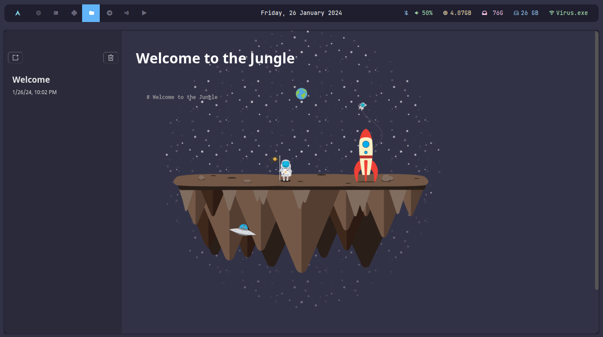

# Markdown AppNote

An Electron application with Vue + TypeScript + UnoCSS + Pinia + MdEditor-v3

[Electron](https://github.com/electron/electron) +
[Vue](https://github.com/vuejs/vue) +
[UnoCSS](https://github.com/unocss/unocss) +
[Pinia](https://github.com/vuejs/pinia) +
[md-editor-v3](https://github.com/imzbf/md-editor-v3)

Inspired By [Gionathas](https://github.com/gionathas/NoteMark)

## Preview

Desktop App


## Project Setup

```bash
git clone repo
```

### Install

```bash
$ pnpm install
```

### Development

```bash
$ pnpm dev
```

### Build

```bash
# For windows
$ pnpm build:win

# For macOS
$ pnpm build:mac

# For Linux
$ pnpm build:linux
```

<!-- linux install -->

- linux install

```bash
$ install dpkg
$ sudo dpkg -i package_name.deb
```

<!-- install archlinux -->

- archlinux install

```bash
$ paru -S debtag
$ sudo debtap -u
$ debtag package_name.deb
$ sudo pacman -U packagename.pkg.tar.zst or packagename.pkg
```
